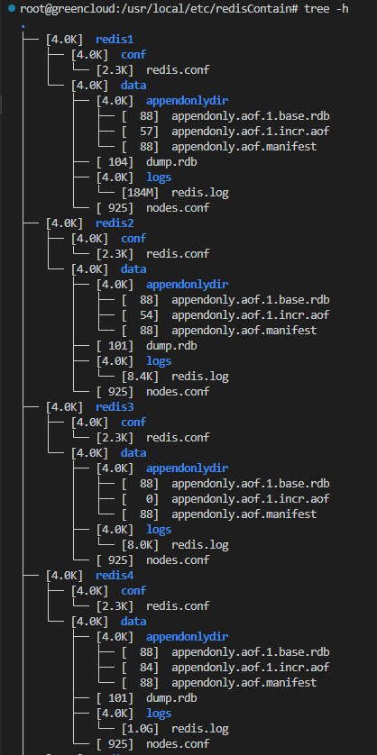
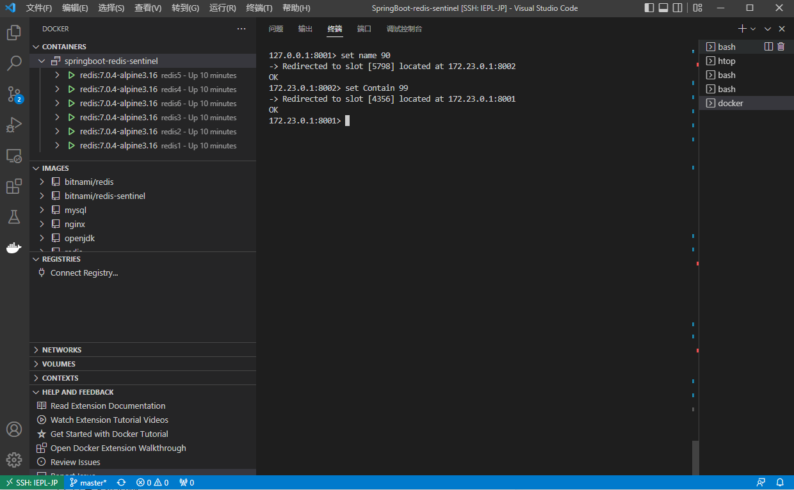
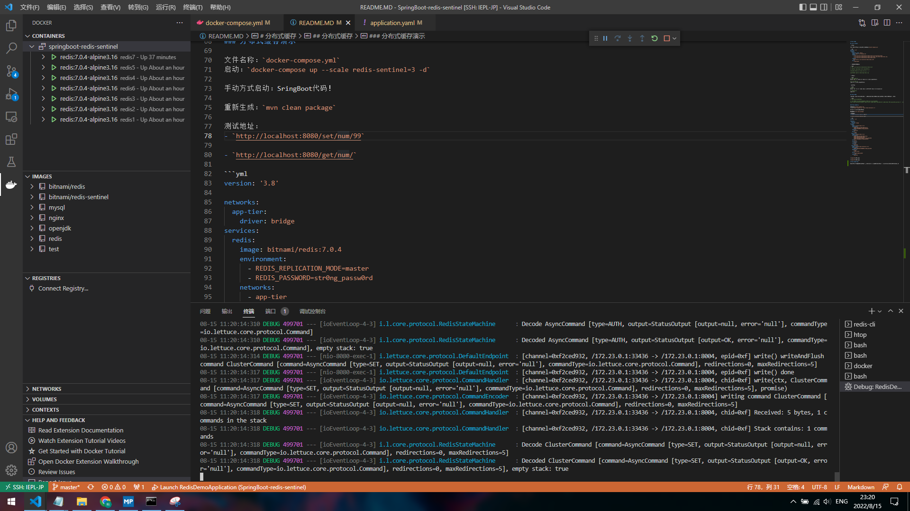

# 分布式缓存

## 单机启动Redis

- 带密码

根据配置，带密码启动redis容器，文件名：`docker-compose.yml`

```yml
version: "3.9"
services:
  redis1:
    container_name: redis1
    image: redis:7.0.4-alpine3.16
    volumes:
      - /usr/local/etc/redisContain/redis1/conf:/usr/local/etc/redis
      - /usr/local/etc/redisContain/redis1/logs/redis.log:/data/logs/redis.log
      - /usr/local/etc/redisContain/redis1/data:/data
    command: 
      redis-server /usr/local/etc/redis/redis.conf
    ports:
      - "6379:6379"
```

- 配置文件内容如下：

```bash
# 路径: /usr/local/etc/redisContain/redis1/conf

# 设置密码 requirepass m2zT_cCmg~B2TYp-5_

# 外网可用则要注释 # bind 127.0.0.1 -::1

# 日志文件 logfile /data/logs/redis.log
```

- 连接方式

```bash
# 直接进入容器内
docker exec -it redis1 sh redis-cli -a m2zT_cCmg~B2TYp-5_

# 宿主机连接进去
redis-cli -a m2zT_cCmg~B2TYp-5_
```

- 不带密码

```bash
# 容器启动
docker run --rm -d --name redis -p 6379:6379 redis:7.0.4-alpine3.16

# 连接到docker
redis-cli
```

## 分布式缓存

注意：运行redis-entinel可能存在一些问题，就是端口设置正确，但是仍然存在像端口设置错误的一些错误.

```bash
# 连接被拒绝说明端口错误.

# 连接被重置，redis端口不允许外部访问，内部注释掉bind即可;
# 若为redis-sentinel，请关闭所有容器，修改为高数值端口再试，或者修改为高数值端口再重启docker容器！(应该是被占用了.)
```

### 分布式缓存演示

文件名称：`docker-compose.yml`
启动：`docker-compose up --scale redis-sentinel=3 -d`

手动方式启动：SringBoot代码！

重新生成：`mvn clean package`

测试地址：
- `http://localhost:8080/set/num/99`

- `http://localhost:8080/get/num/`

```yml
version: '3.8'

networks:
  app-tier:
    driver: bridge
services:
  redis:
    image: bitnami/redis:7.0.4
    environment:
      - REDIS_REPLICATION_MODE=master
      - REDIS_PASSWORD=str0ng_passw0rd
    networks:
      - app-tier
    ports:
      - '6379'
  redis-slave:
    image: bitnami/redis:7.0.4
    environment:
      - REDIS_REPLICATION_MODE=slave
      - REDIS_MASTER_HOST=redis
      - REDIS_MASTER_PASSWORD=str0ng_passw0rd
      - REDIS_PASSWORD=str0ng_passw0rd
    ports:
      - '6379'
    depends_on:
      - redis
    networks:
      - app-tier
  redis-sentinel:
    image: bitnami/redis-sentinel:7.0.4
    environment:
      - REDIS_MASTER_PASSWORD=str0ng_passw0rd
    depends_on:
      - redis
      - redis-slave
    ports:
      - '26379-26381:26379'
    networks:
      - app-tier
```


 

# 分布式缓存-集群

Redis分布式集群最终版，此时不再使用Sentinel作为哨兵监控redis状态，开启cluster模式的redis可以互相监听。


## 配置redis集群


- docker-compose.yml文件配置

可以先启动前面6个，最后再通过docker-compose up -d追加方式启动第七个,主要是为了演示插槽的移动！

```yml
version: "3.9"
networks:
  app-tier:
    driver: bridge
services:
  redis1:
    container_name: redis1
    image: redis:7.0.4-alpine3.16
    volumes:
      - /usr/local/etc/redisContain/redis1/conf:/usr/local/etc/redis
      - /usr/local/etc/redisContain/redis1/data:/data
    networks:
      - app-tier
    command: redis-server /usr/local/etc/redis/redis.conf
    ports:
      - "8001:8001"
      - "18001:18001"
  redis2:
    container_name: redis2
    image: redis:7.0.4-alpine3.16
    volumes:
      - /usr/local/etc/redisContain/redis2/conf:/usr/local/etc/redis
      - /usr/local/etc/redisContain/redis2/data:/data
    networks:
      - app-tier
    command: redis-server /usr/local/etc/redis/redis.conf
    ports:
      - "8002:8002"
      - "18002:18002"
  redis3:
    container_name: redis3
    image: redis:7.0.4-alpine3.16
    volumes:
      - /usr/local/etc/redisContain/redis3/conf:/usr/local/etc/redis
      - /usr/local/etc/redisContain/redis3/data:/data
    networks:
      - app-tier
    command: redis-server /usr/local/etc/redis/redis.conf
    ports:
      - "8003:8003"
      - "18003:18003"
  redis4:
    container_name: redis4
    image: redis:7.0.4-alpine3.16
    volumes:
      - /usr/local/etc/redisContain/redis4/conf:/usr/local/etc/redis
      - /usr/local/etc/redisContain/redis4/data:/data
    networks:
      - app-tier
    command: redis-server /usr/local/etc/redis/redis.conf
    ports:
      - "8004:8004"
      - "18004:18004"
  redis5:
    container_name: redis5
    image: redis:7.0.4-alpine3.16
    volumes:
      - /usr/local/etc/redisContain/redis5/conf:/usr/local/etc/redis
      - /usr/local/etc/redisContain/redis5/data:/data
    networks:
      - app-tier
    command: redis-server /usr/local/etc/redis/redis.conf
    ports:
      - "8005:8005"
      - "18005:18005"
  redis6:
    container_name: redis6
    image: redis:7.0.4-alpine3.16
    volumes:
      - /usr/local/etc/redisContain/redis6/conf:/usr/local/etc/redis
      - /usr/local/etc/redisContain/redis6/data:/data
    networks:
      - app-tier
    command: redis-server /usr/local/etc/redis/redis.conf
    ports:
      - "8006:8006"
      - "18006:18006"
  redis7:
    container_name: redis7
    image: redis:7.0.4-alpine3.16
    volumes:
      - /usr/local/etc/redisContain/redis7/conf:/usr/local/etc/redis
      - /usr/local/etc/redisContain/redis7/data:/data
    networks:
      - app-tier
    command: redis-server /usr/local/etc/redis/redis.conf
    ports:
      - "8007:8007"
      - "18007:18007"
````

- redis 启动配置的路径图

 

- 清理一些文件

```bash
# 清理数据，方便演示.
cd /usr/local/etc/redisContain
find . -name "*confbak" | xargs rm -rf
find . -name "dump*" | xargs rm -rf
find . -name "append*" | xargs rm -rf
find . -name "nodes.conf" | xargs rm -rf
find . -name "nodes.conf" | xargs rm -rf
```

## 开启redis集群

- 运行：`docker-compose up -d`

## 创建redis集群
- 像前面启动方式一样，追加启动第七个redis.

- 创建集群：运行 `docker-compose up -d`

```bash
# 进入任意redis容器
docker exec -it redis1 sh

# 创建集群
# 每个主节点有一个镜像，默认为：拆分的前半部分为主，后半部分为从.
redis-cli -a m2zT_cCmg~B2TYp-5_ --cluster create --cluster-replicas 1 \
91.199.209.120:8001 91.199.209.120:8002 91.199.209.120:8003 91.199.209.120:8004 91.199.209.120:8005 91.199.209.120:8006

# 测试集群方式存
# 进入到redis1
# redis-cli -c -a m2zT_cCmg~B2TYp-5_ -p 8001
redis-cli -c -a m2zT_cCmg~B2TYp-5_ -h 91.199.209.120 -p 8001
```

## 新增or移除redis

需要进入redis集群的任意容器内部运行.

### 新加入一个redis节点

```bash
# 默认新增为主节点
redis-cli -a m2zT_cCmg~B2TYp-5_ --cluster add-node 91.199.209.120:8007 91.199.209.120:8001

# 分配插槽到新节点
redis-cli -a m2zT_cCmg~B2TYp-5_ --cluster reshard 91.199.209.120:8007

# 移动插槽
```
PS：移除是移走插槽，再删除节点！

```bash
# 演示如下：

# 删除
# 查看redis内部节点状态：cluster nodes
# 登陆到容器内：docker exec -it redis1 sh
# 注意ip为显示的ip.
redis-cli  -a m2zT_cCmg~B2TYp-5_ --cluster del-node 172.24.0.1:8007 0e1a99814da384191d710130046d559af573de29
```

### 加入则为从节点

- 直接让新加成为已有master的从节点

```bash
# 已有主节点id：48c9efc03172d94c4aaa01b330eb309a1711d567
# 新加为：8007，由8001广播给整个集群,这个是新加入的.
redis-cli -a m2zT_cCmg~B2TYp-5_ --cluster add-node 91.199.209.120:8007 91.199.209.120:8001  \
--cluster-slave   --cluster-master-id 48c9efc03172d94c4aaa01b330eb309a1711d567
```

访问演示：

 

 


## 主从切换

- 8001为8004主，下面将8004升级为主，8001为从.

```bash
# 进入8004的redis容器中！
redis-cli -a m2zT_cCmg~B2TYp-5_ -c -p 8004
cluster failover
```