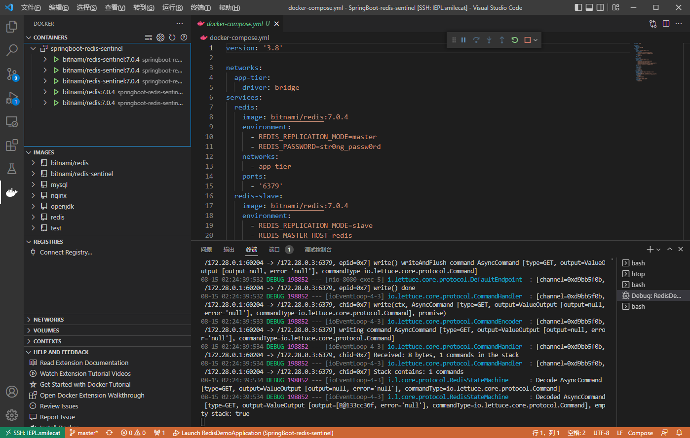
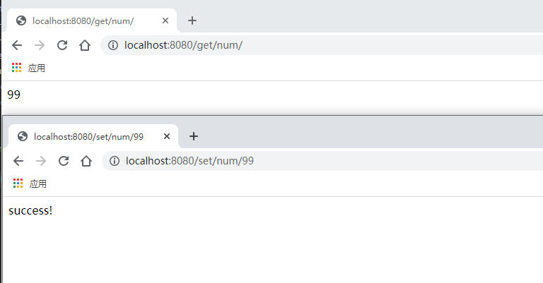

# 分布式缓存

## 单机启动Redis

- 带密码

根据配置，带密码启动redis容器，文件名：`docker-compose.yml`

```yml
version: "3.9"
services:
  redis1:
    container_name: redis1
    image: redis:7.0.4-alpine3.16
    volumes:
      - /usr/local/etc/redisContain/redis1/conf:/usr/local/etc/redis
      - /usr/local/etc/redisContain/redis1/logs/redis.log:/data/logs/redis.log
      - /usr/local/etc/redisContain/redis1/data:/data
    command: 
      redis-server /usr/local/etc/redis/redis.conf
    ports:
      - "6379:6379"
```

- 配置文件内容如下：

```bash
# 路径: /usr/local/etc/redisContain/redis1/conf

# 设置密码 requirepass m2zT_cCmg~B2TYp-5_

# 外网可用则要注释 # bind 127.0.0.1 -::1

# 日志文件 logfile /data/logs/redis.log
```

- 连接方式

```bash
# 直接进入容器内
docker exec -it redis1 sh redis-cli -a m2zT_cCmg~B2TYp-5_

# 宿主机连接进去
redis-cli -a m2zT_cCmg~B2TYp-5_
```

- 不带密码

```bash
# 容器启动
docker run --rm -d --name redis -p 6379:6379 redis:7.0.4-alpine3.16

# 连接到docker
redis-cli
```

## 分布式缓存

注意：运行redis-entinel可能存在一些问题，就是端口设置正确，但是仍然存在像端口设置错误的一些错误.

```bash
# 连接被拒绝说明端口错误.

# 连接被重置，redis端口不允许外部访问，内部注释掉bind即可;
# 若为redis-sentinel，请关闭所有容器，修改为高数值端口再试，或者修改为高数值端口再重启docker容器！(应该是被占用了.)
```

### 分布式缓存演示

文件名称：`docker-compose.yml`
启动：`docker-compose up --scale redis-sentinel=3 -d`

手动方式启动：SringBoot代码！

重新生成：`mvn clean package`

测试地址：
- `http://localhost:8080/set/num/99`

- `http://localhost:8080/get/num/`

```yml
version: '3.8'

networks:
  app-tier:
    driver: bridge
services:
  redis:
    image: bitnami/redis:7.0.4
    environment:
      - REDIS_REPLICATION_MODE=master
      - REDIS_PASSWORD=str0ng_passw0rd
    networks:
      - app-tier
    ports:
      - '6379'
  redis-slave:
    image: bitnami/redis:7.0.4
    environment:
      - REDIS_REPLICATION_MODE=slave
      - REDIS_MASTER_HOST=redis
      - REDIS_MASTER_PASSWORD=str0ng_passw0rd
      - REDIS_PASSWORD=str0ng_passw0rd
    ports:
      - '6379'
    depends_on:
      - redis
    networks:
      - app-tier
  redis-sentinel:
    image: bitnami/redis-sentinel:7.0.4
    environment:
      - REDIS_MASTER_PASSWORD=str0ng_passw0rd
    depends_on:
      - redis
      - redis-slave
    ports:
      - '26379-26381:26379'
    networks:
      - app-tier
```



 